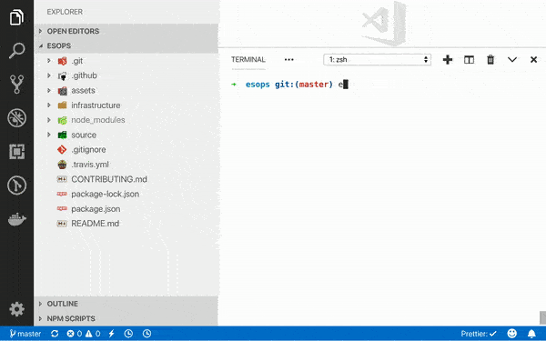

<div align="center">


</div>

<h1 align="center">esops</h1>

<div align="center">
  <h3 align="center">Decoupled & Composable Infrastructure</h3>
  <h6 align="center">Decouple your infrastructure with composable auto-ignored template generation Files.</h6>
</div>

<p align="center">
  <a href="https://npmjs.org/package/esops">
    
  </a>
  <a href="https://travis-ci.org/sartaj/esops">
    
  </a>
</p>

-   **Decouple Codependent Config Files**: manage codependent config files like `.eslintrc`, `tsconfig.json`, `.prettierrc`, `.editorconfig`, and `.vscode` files in a separate directory or module.
-   **Decouple devDependencies**: Create your final `package.json` from composable pieces of `package.json`. This allows you manage devDependencies as a separate repository.
-   **Compose Your Dev Environment**: Compose elements of your dev environment and infrastructure from smaller pieces. `esops` uses user-defined explicit merge rules and enforces the use of git tags for immutable version management for infrastructure components.
-   **Provide Reference Implementations and Design Docs**: Create reference implementations that can be installed without polluting your `git` or `npm` publishes.

<div align="center">



</div>

### Packs To Try

| **package**                                                                               | **description**                              |
| ----------------------------------------------------------------------------------------- | -------------------------------------------- |
| [`"github:sartaj/typescript-node-stack"`](http://github.com/sartaj/typescript-node-stack) | Have typescript with node tests ready to go. |

## Install

Install globally or locally

### Global

```bash
npm install -g esops
yarn global add esops
```

### Local

```bash
npm install -save-dev esops
yarn add esops --dev`
```

## Setup

Config esops in `esops.json`

**`esops.json`**

```json
["github:sartaj/typescript-node-stack#master"]
```

## Resolution Types

-   _Filesystem:_ `['./infrastructure']`
-   _GitHub:_ `['github:user/repo#tag|branch']`

## Running

If global, just run `esops`. If local, use `npx esops`. Files will be generated, and if you have a `.gitignore`, it will be updated to include the generated files.

## To Clean Files

To refresh your codebase, if you had a `.gitignore` and esops generated an ignore list there, you can remove files all `.gitignore`'d files [using a git command](https://stackoverflow.com/q/13541615) or a module like [remove-git-ignored](https://www.npmjs.com/package/remove-git-ignored).

## Why

There are so many developer tools out there, like `eslint`, `prettier`, and `typescript`, that have codependent config files that have to be available at the root level of project to enable features like code editor integration. The management of these files can be considered a separate concern from your project goal.

By separating these files, and adding them as auto-ignored template files, you can update and manage your infrastructure separately from your client code.

New `eslint` settings? Need to support `prettier` now? Someone on the team wants better `vscode` integration? With `esops`, generated files don't pollute git or npm, thus not having to deal with rebasing or codgen issues that happen with other template generators.

## Credits

-   Logo: [Gilbert Baker Font](https://www.typewithpride.com/)
